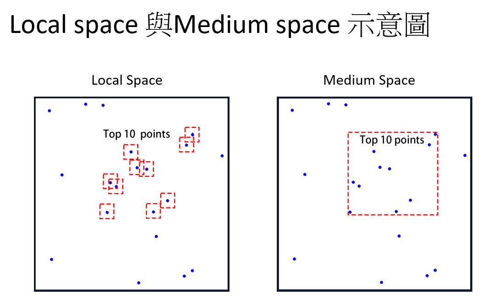

# Tea parameter optimization

## Structure in this repository
- AEDT_Auto.py : Let Ansys automatically simulate candidates model parameter. 
- analyze_data.py : After Ansys outputs the result of simulation, we should calculate the average electric field.
- model.py : Initial point with Random sampling, deal with input and output, In this file  
- smt_test.py : global optimization model implementation here.

## Whole workflow


## The way to run this repository
1. You have to get some initial points from model.py. You should open line 75(parameters = initial_LHS_model()), and comment line 78 (parameters = model.find_max(i)). These parameter setting will be stored in a text file. After get some points, We can start running whole workflow.
2. Open command line and run
   ```
   python model.py
   ```
4. open Ansys and run script AEDT_Auto.py.
### it is noteworthy that we use cracked version, so Ansys will crash after we run around 250 iterations, so you should restart the workflow.

## Global optimization model 
1. Define objective value and parameter limitation
2. Using LHS or random sample method to get some points for initializing model, and put those points into Ansys and get ground truth. 
3. After model is initialized, we can start to run optimization.
4. There are three searching space, when iteration mod 5 is 0 or 1 or 3, it will go into local space. When iteraion mod 5 is 2, it will go into medium space.  When iteraion mod 5 is 4, it will go into global space.
   - local space : find the top 5 eletric field parameter setting, and each setting randomly slightly modify 6 times. And finally get 30 points. 
   - medium space : find the top 5 eletric field parameter setting, using max and min of each parameter to create a boundary, and then find 30 points inside.  
   - global space : random sample 30 points.
   
5. We use multiple model as surrogate model, since different model may use different view to see the data. Therefore, 30 candidate points which we get at step 4 will be predicted by each model. If both model take the same setting as maximum eletric field, we will create one setting and let Ansys simulate. However, if both model take different setting, we will have two setting for simulation in one iteration.
6. After Ansys simluate and output result, we will put these result into dataset and improve the model accuracy.
### Below is model structure


## Environment
- python 3.11
- SMT 2.0
- Ansys 2020

## Result


